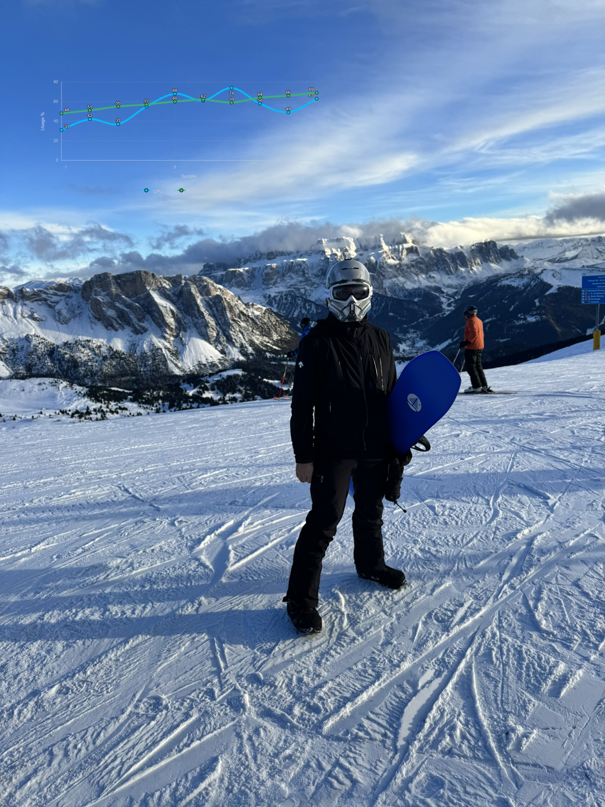

# ImagePlayground

  [](https://github.com/EvotecIT/ImagePlayground/actions/workflows/test_dotnet.yml)
  [](https://app.codecov.io/gh/EvotecIT/ImagePlayground)
  [](https://github.com/EvotecIT/ImagePlayground)

  [](https://github.com/EvotecIT/ImagePlayground/actions/workflows/test_powershell.yml)
  [](https://www.powershellgallery.com/packages/ImagePlayground)
  [](https://www.powershellgallery.com/packages/ImagePlayground)

  [](https://www.powershellgallery.com/packages/ImagePlayground)
  [](https://github.com/EvotecIT/ImagePlayground)
  [](https://github.com/EvotecIT/ImagePlayground)
  [](https://www.powershellgallery.com/packages/ImagePlayground)

  [](https://twitter.com/PrzemyslawKlys)
  [](https://evotec.xyz/hub)
  [](https://www.linkedin.com/in/pklys)
  [](https://evo.yt/discord)

`ImagePlayground` is a C# library and a PowerShell module that allows you to play with images in different ways.
It allows to create QR codes, BAR codes, Charts and do image manipulation.
It provides ability to read QR codes and BAR codes.
It provides ability to manipulate images by adding text, resizing, cropping, rotating, blurring, sharpening, etc.
It provides way to add watermark to images - either by text or by image.

## Known Issues

This module works on PowerShell 5.1 and PowerShell 7+. It runs on Windows, Linux and macOS with full chart support on every platform.

**Currently the module has a problem when running in VSCode PowerShell extension when on PowerShell 5.1 (other versions work fine!)**
It works fine when running in PowerShell 5.1 console, or ISE (shrug!).

## Features
- ☑️ **QR code generation and reading**  
  Supports standard QR codes, contact cards, WiFi details, SMS, phone numbers, OTP, Bitcoin, Monero, BezahlCode, Girocode, Swiss, Slovenian UPN, ShadowSocks, SkypeCall, GeoLocation and more.
- ☑️ **Barcode generation and reading**  
  Supports Code128, Code93, Code39, Kix Code, UPC-A, UPC-E, EAN, Data Matrix and PDF417.
- ☑️ **Chart creation**
  Create bar, horizontal bar, line, step line, area, step area, stacked area, lollipop, scatter, bubble, range, box plot, slope, pie, donut, radial, gauge, circle, bullet, waterfall, funnel, treemap, heatmap, histogram, progress, pictorial and word-cloud charts using ChartForgeX.
- ☑️ **Image manipulation**  
  Combine, merge, resize, crop, rotate, flip, grayscale, blur, sharpen, pixelate, polaroid, bokeh blur, oil paint, contrast, brightness, hue, saturation, lightness, opacity, invert, sepia, kodachrome, lomograph, histogram equalization, vignette, skew, watermark (text or image) and add text.
- ☑️ **Avatar, icon, thumbnail and grid generation**
- ☑️ **Animated GIF creation**
- ☑️ **Base64 conversion**
- ☑️ **EXIF metadata management**
- ☑️ **Image comparison**
- ☑️ **Pipeline support**  
  Cmdlets that use `-FilePath` accept the path from the pipeline.


## Available Cmdlets

- `Add-ImageText` - Adds text to an image at the provided coordinates and writes the updated image to disk.
- `Add-ImageTextBox` - Adds wrapped text to an image within a box.
- `Add-ImageWatermark` - Adds a watermark image to another image.
- `Compare-Image` - Compares two images and optionally saves a difference mask.
- `ConvertFrom-ImageBase64` - Converts a Base64 encoded string into an image file.
- `ConvertTo-Image` - Converts an image to a different format.
- `ConvertTo-ImageBase64` - Converts an image file into a Base64 encoded string.
- `Get-Image` - Loads an image from disk.
- `Get-ImageBarCode` - Reads barcode information from an image file.
- `Get-ImageExif` - Gets EXIF metadata from an image.
- `Get-ImageQRCode` - Reads QR code information from an image file.
- `Merge-Image` - Merges two images and saves the result.
- `New-ImageAvatar` - Creates a rounded avatar image.
- `New-ImageBarCode` - Creates a barcode image.
- `New-ImageChart` - Creates an image chart from definitions.
- `New-ImageChartAnnotation` - Creates chart annotation data item.
- `New-ImageChartBar` - Creates bar chart data item.
- `New-ImageChartBarOptions` - Creates bar chart options.
- `New-ImageChartBoxPlot` - Creates box-plot chart data item.
- `New-ImageChartBullet` - Creates bullet chart data item.
- `New-ImageChartCircle` - Creates circle status chart data item.
- `New-ImageChartDonut` - Creates donut chart data item.
- `New-ImageChartFunnel` - Creates funnel chart item.
- `New-ImageChartGauge` - Creates gauge chart data item.
- `New-ImageChartHeatmap` - Creates heatmap chart data item.
- `New-ImageChartHistogram` - Creates histogram chart data item.
- `New-ImageChartHorizontalBar` - Creates horizontal bar chart data item.
- `New-ImageChartLine` - Creates line chart data item.
- `New-ImageChartLollipop` - Creates lollipop chart data item.
- `New-ImageChartOptions` - Creates shared ChartForgeX renderer options.
- `New-ImageChartPie` - Creates pie chart data item.
- `New-ImageChartPictorial` - Creates pictorial chart data item.
- `New-ImageChartPolar` - Creates polar chart data item.
- `New-ImageChartProgress` - Creates progress-bar chart data item.
- `New-ImageChartRangeBand` - Creates range-band chart data item.
- `New-ImageChartRangeBar` - Creates range-bar chart data item.
- `New-ImageChartRadial` - Creates radial gauge chart data item.
- `New-ImageChartScatter` - Creates scatter chart data item.
- `New-ImageChartSlope` - Creates slope chart data item.
- `New-ImageChartStackedArea` - Creates stacked-area chart data item.
- `New-ImageChartStepArea` - Creates step-area chart data item.
- `New-ImageChartStepLine` - Creates step-line chart data item.
- `New-ImageChartTreemap` - Creates treemap chart item.
- `New-ImageChartWaterfall` - Creates waterfall chart data item.
- `New-ImageChartWordCloud` - Creates word cloud chart data item.
- `New-ImageCrop` - Creates a cropped version of an image using rectangular, circular or polygonal areas.
- `New-ImageGif` - Creates an animated GIF from existing images.
- `New-ImageGrid` - Creates a simple grid-based image.
- `New-ImageIcon` - Creates an icon file from an image.
- `New-ImageQRCode` - Generates a QR code image.
- `New-ImageQRCodeBezahlCode` - Generates a BezahlCode QR for German payments.
- `New-ImageQRCodeBitcoin` - Generates a QR code for Bitcoin-like payments.
- `New-ImageQRCodeGeoLocation` - Generates a QR code with geolocation data.
- `New-ImageQRCodeGirocode` - Generates a Girocode QR code.
- `New-ImageQRCodeMonero` - Generates a QR code for a Monero transaction.
- `New-ImageQRCodeOtp` - Generates a QR code for one-time-password configuration.
- `New-ImageQRCodePhoneNumber` - Generates a QR code for dialling a phone number.
- `New-ImageQRCodeShadowSocks` - Generates a QR code for a Shadowsocks configuration.
- `New-ImageQRCodeSkypeCall` - Generates a QR code initiating a Skype call.
- `New-ImageQRCodeSlovenianUpnQr` - Generates a Slovenian UPN QR payment code.
- `New-ImageQRCodeSms` - Generates a QR code containing an SMS message.
- `New-ImageQRCodeSwiss` - Generates a Swiss QR payment code.
- `New-ImageQRCodeWiFi` - Creates a WiFi QR code image.
- `New-ImageQRContact` - Generates a QR code image containing the provided contact details.
- `New-ImageThumbnail` - Creates thumbnails for all images in a directory.
- `Clear-ImageThumbnailCache` - Removes cached thumbnails.
- `Remove-ImageExif` - Removes EXIF metadata from an image.
- `Resize-Image` - Resizes an image.
- `Save-Image` - Saves an image to disk.
- `Set-ImageExif` - Sets an EXIF tag value in an image.

## Installation

```powershell
Install-Module ImagePlayground -Force -Verbose
```

## Quick Recipes

The generated cmdlet help lives in [Docs/Readme.md](Docs/Readme.md). These examples focus on end-to-end scenarios you are likely to automate first.

### Create and verify a WiFi QR code

```powershell
$wifiPath = Join-Path -Path $PSScriptRoot -ChildPath 'Output\OfficeWiFi.png'

New-ImageQRCodeWiFi -SSID 'Evotec-Office' -Password 'StrongerPassword!2026' -FilePath $wifiPath

$decoded = Get-ImageQRCode -FilePath $wifiPath
$decoded | Format-List Status, Type, Message
```

### Create an OTP QR code for an authenticator app

```powershell
New-ImageQRCodeOtp -Secret 'JBSWY3DPEHPK3PXP' -AccountName 'ops@evotec.pl' -Issuer 'Evotec' -Algorithm SHA1 -Digits 6 -FilePath "$PSScriptRoot\Output\Otp.png"
```

### Create a payment QR code ready to share with a customer

```powershell
New-ImageQRCodeGirocode -Name 'Evotec Sp. z o.o.' -IBAN 'DE23100000001234567890' -BIC 'MARKDEF1100' -Amount 149.99 -Purpose 'Invoice 2026-041' -RemittanceInformation 'Consulting services' -FilePath "$PSScriptRoot\Output\Invoice-Girocode.png"
```

### Build a themed chart with annotations

```powershell
$definitions = @(
    New-ImageChartLine -Name 'CPU' -Value 31,42,58,67,53 -Color LimeGreen -Marker Circle -Smooth
    New-ImageChartLine -Name 'Memory' -Value 48,51,55,57,60 -Color DeepSkyBlue -Marker Square
)

$annotations = @(
    New-ImageChartAnnotation -X 4 -Y 67 -Text 'Peak CPU' -Arrow
)

$options = New-ImageChartOptions -ShowLegend -LegendPosition Right -ShowDataLabels
New-ImageChart -Definition $definitions -Annotation $annotations -Theme Dark -ShowGrid -XTitle 'Sample' -YTitle 'Usage %' -Options $options -FilePath "$PSScriptRoot\Output\SystemUsage.png"
```

### Render a native ChartForgeX chart

```powershell
$chart = [ChartForgeX.Core.Chart]::Create().WithSize(640, 360).WithTitle('Daily Requests')
$points = [ChartForgeX.Primitives.ChartPoint[]] @(
    [ChartForgeX.Primitives.ChartPoint]::new(1, 120)
    [ChartForgeX.Primitives.ChartPoint]::new(2, 148)
    [ChartForgeX.Primitives.ChartPoint]::new(3, 136)
)

[void] $chart.AddBar('Requests', $points, [ChartForgeX.Primitives.ChartColor]::FromHex('#2563EB'))

New-ImageChart -Chart $chart -FilePath "$PSScriptRoot\Output\Requests.png"
```

### Update EXIF metadata before publishing an image

```powershell
$exifPath = "$PSScriptRoot\Output\PhotoWithExif.jpg"

Set-ImageExif -FilePath "$PSScriptRoot\Samples\PrzemyslawKlysAndKulkozaurr.jpg" -ExifTag ([SixLabors.ImageSharp.Metadata.Profiles.Exif.ExifTag]::Copyright) -Value 'Copyright (c) Evotec 2026' -FilePathOutput $exifPath

Get-ImageExif -FilePath $exifPath -Translate | Format-List Copyright*
```

## Usage

### Creating and reading QR Codes

Creating basic QR Code

```powershell
New-ImageQRCode -Content 'https://evotec.xyz' -FilePath "$PSScriptRoot\Samples\QRCode.png"
```


Creating QR codes and reading them back is as easy as:

```powershell
New-ImageQRContact -FilePath "$PSScriptRoot\Samples\QRCodeContact.png" -outputType VCard4 -Firstname "Przemek" -Lastname "Klys" -MobilePhone "+48 500 000 000"

$Message = Get-ImageQRCode -FilePath "$PSScriptRoot\Samples\QRCodeContact.png"
$Message | Format-List *

New-ImageQRCodeWiFi -SSID 'Evotec' -Password 'EvotecPassword' -FilePath "$PSScriptRoot\Samples\QRCodeWiFi.png"

$Message = Get-ImageQRCode -FilePath "$PSScriptRoot\Samples\QRCodeWiFi.png"
$Message | Format-List *

New-ImageQRCode -Content 'https://evotec.xyz' -FilePath "$PSScriptRoot\Samples\QRCode.png"

$Message = Get-ImageQRCode -FilePath "$PSScriptRoot\Samples\QRCode.png"
$Message | Format-List *
```

### Creating charts

Use `-XTitle` and `-YTitle` on `New-ImageChart` to specify axis titles.

#### Bar charts

```powershell
New-ImageChart {
    New-ImageChartBar -Value 5 -Label "C#"
    New-ImageChartBar -Value 12 -Label "C++"
    New-ImageChartBar -Value 10 -Label "PowerShell"
} -Show -FilePath $PSScriptRoot\Samples\ChartsBar1.png
```


#### Pie charts

```powershell
New-ImageChart {
    New-ImageChartPie -Name "C#" -Value 5
    New-ImageChartPie -Name "C++" -Value 12
    New-ImageChartPie -Name "PowerShell" -Value 10
} -Show -FilePath $PSScriptRoot\Output\ChartsPie1.png -Width 500 -Height 500
```


#### Line charts

```powershell
New-ImageChart {
    New-ImageChartLine -Value 5, 10, 12, 18, 10, 13 -Name "C#" -Marker Circle -Smooth
    New-ImageChartLine -Value 10,15,30,40,50,60 -Name "C++" -Marker Square
    New-ImageChartLine -Value 10,5,12,18,30,60 -Name "PowerShell" -Marker Diamond
} -Show -FilePath $PSScriptRoot\Output\ChartsLine1.png
```


#### Scatter charts

```powershell
New-ImageChart {
    New-ImageChartScatter -Name "First" -X 1,2,3 -Y 4,5,6
    New-ImageChartScatter -Name "Second" -X 1,2,3 -Y 3,2,1
} -Show -FilePath $PSScriptRoot\Output\ChartsScatter.png -Width 500 -Height 500
```

#### Polar charts

```powershell
New-ImageChart {
    New-ImageChartPolar -Name "Series1" -Angle 0,1.57 -Value 1,2
    New-ImageChartPolar -Name "Series2" -Angle 0.5,2.2 -Value 2,1.5
} -Show -FilePath $PSScriptRoot\Output\ChartsPolar.png -Width 500 -Height 500
```

#### Radar charts

```powershell
New-ImageChart {
    New-ImageChartRadial -Name "C#" -Value 5
    New-ImageChartRadial -Name "AutoIt v3" -Value 50
    New-ImageChartRadial -Name "PowerShell" -Value 10
    New-ImageChartRadial -Name "C++" -Value 18
    New-ImageChartRadial -Name "F#" -Value 100
} -Show -FilePath $PSScriptRoot\Samples\ChartsRadial.png -Width 500 -Height 500
```


#### Heatmap charts

```powershell
$matrix = [double[,]]::new(2,2)
$matrix[0,0] = 1
$matrix[0,1] = 2
$matrix[1,0] = 3
$matrix[1,1] = 4
New-ImageChart {
    New-ImageChartHeatmap -Name 'Heat' -Matrix $matrix
} -Show -FilePath $PSScriptRoot\Output\ChartsHeatmap.png -Width 500 -Height 500
```

#### Histogram charts

```powershell
New-ImageChart {
    New-ImageChartHistogram -Name 'Data' -Values 1,2,3,3,4,5 -BinSize 2
} -Show -FilePath $PSScriptRoot\Output\ChartsHistogram.png -Width 500 -Height 500
```

#### Charts with annotations

```powershell
New-ImageChart -ChartsDefinition {
    New-ImageChartLine -Name 'Sample' -Value 1,3,2,5 -Marker Circle
} -AnnotationsDefinition {
    New-ImageChartAnnotation -X 3 -Y 5 -Text 'Peak' -Arrow
} -Show -FilePath $PSScriptRoot\Samples\ChartsAnnotated.png -Width 500 -Height 300
```

#### ChartForgeX chart families and options

```powershell
$options = New-ImageChartOptions -ShowLegend -LegendPosition Right -ShowDataLabels -DonutCenterValue '100%' -DonutCenterLabel 'Capacity'

New-ImageChart {
    New-ImageChartDonut -Name 'Used' -Value 72 -Color Crimson
    New-ImageChartDonut -Name 'Free' -Value 28 -Color MediumSeaGreen
} -Options $options -Show -FilePath $PSScriptRoot\Output\ChartsDonut.png -Width 500 -Height 360

New-ImageChart {
    New-ImageChartProgress -Name 'CPU' -Value 64 -Color Orange
    New-ImageChartProgress -Name 'Memory' -Value 71 -Color DeepSkyBlue
} -Options (New-ImageChartOptions -ProgressMaximum 100 -NoProgressHandles) -Show -FilePath $PSScriptRoot\Output\ChartsProgress.png

New-ImageChart {
    New-ImageChartPictorial -Name 'Enabled' -Value 8 -Color MediumSeaGreen
    New-ImageChartPictorial -Name 'Disabled' -Value 2 -Color Gray
} -Options (New-ImageChartOptions -PictorialSymbol Person -PictorialColumns 10) -Show -FilePath $PSScriptRoot\Output\ChartsPictorial.png
```

#### Additional ChartForgeX DSL charts

```powershell
New-ImageChart {
    New-ImageChartHorizontalBar -Name 'Disk' -Value 72,28 -Color DeepSkyBlue
} -Options (New-ImageChartOptions -ShowLegend -NoCard -NoPlotBackground) -Show -FilePath $PSScriptRoot\Output\ChartsHorizontalBar.png

New-ImageChart {
    New-ImageChartBullet -Name 'Servers patched' -Value 92 -Target 95 -RangeEnds 70,85 -Color MediumSeaGreen
    New-ImageChartBullet -Name 'Workstations patched' -Value 86 -Target 90 -RangeEnds 70,85 -Color Orange
} -Options (New-ImageChartOptions -NoCard -NoPlotBackground) -Show -FilePath $PSScriptRoot\Output\ChartsBullet.png -Width 700 -Height 320

New-ImageChart {
    New-ImageChartTreemap -Name 'Servers' -Value 42 -Color DeepSkyBlue
    New-ImageChartTreemap -Name 'Workstations' -Value 120 -Color MediumSeaGreen
    New-ImageChartTreemap -Name 'Laptops' -Value 80 -Color Orange
} -Options (New-ImageChartOptions -ShowPointLegend) -Show -FilePath $PSScriptRoot\Output\ChartsTreemap.png -Width 700 -Height 420
```

#### Transparent charts and export formats

`New-ImageChart` can write PNG, SVG and HTML from the same definition. Use `New-ImageChartOptions -Transparent -NoCard -NoPlotBackground` when the chart should be composited over another image and only the chart ink, labels, grid and legend should remain visible.

```powershell
$definitions = @(
    New-ImageChartLine -Name 'CPU' -Value 31,42,37,55,68,61,74,58,49,63 -Color DeepSkyBlue -Marker Circle -Smooth
    New-ImageChartLine -Name 'Memory' -Value 48,51,55,57,60,62,59,64,66,69 -Color MediumSeaGreen -Marker Square -Smooth
)

$options = New-ImageChartOptions -Transparent -NoCard -NoPlotBackground -ShowLegend -LegendPosition Bottom -ShowDataLabels

New-ImageChart -Definition $definitions -Theme Dark -ShowGrid -XTitle 'Sample' -YTitle 'Usage %' -Options $options -FilePath $PSScriptRoot\Samples\ChartsChartForgeXTransparent.png -Width 760 -Height 420
New-ImageChart -Definition $definitions -Theme Dark -ShowGrid -XTitle 'Sample' -YTitle 'Usage %' -Options $options -FilePath $PSScriptRoot\Samples\ChartsChartForgeXTrend.svg -Width 760 -Height 420
New-ImageChart -Definition $definitions -Theme Dark -ShowGrid -XTitle 'Sample' -YTitle 'Usage %' -Options $options -FilePath $PSScriptRoot\Samples\ChartsChartForgeXTrend.html -Width 760 -Height 420
```



The repository script `Examples\Charts.ChartForgeX.Showcase.ps1` generates the transparent overlay plus focused donut, progress, pictorial and word-cloud examples.

### Reading bar codes

```powershell
Get-ImageBarCode -FilePath $PSScriptRoot\Samples\BarcodeEAN13.png
Get-ImageBarCode -FilePath $PSScriptRoot\Samples\BarcodeEAN7.png
```

### Creating bar codes

Supported values: `Code128`, `Code93`, `Code39`, `KixCode`, `UPCE`, `UPCA`, `EAN`, `DataMatrix`, `PDF417`

```powershell
New-ImageBarCode -Type DataMatrix -Value 'DataMatrixExample' -FilePath $PSScriptRoot\Samples\DataMatrix.png
New-ImageBarCode -Type Code128 -Value '1234567890' -FilePath $PSScriptRoot\Samples\BarcodeCode128.png
New-ImageBarCode -Type PDF417 -Value 'Pdf417Example' -FilePath $PSScriptRoot\Samples\Pdf417.png
```

```csharp
BarCode.Generate(BarCode.BarcodeTypes.DataMatrix, "DataMatrixExample", "DataMatrix.png");
BarCode.Generate(BarCode.BarcodeTypes.Code128, "1234567890", "BarcodeCode128.png");
BarCode.Generate(BarCode.BarcodeTypes.PDF417, "Pdf417Example", "Pdf417.png");
var result = BarCode.Read("DataMatrix.png");
Console.WriteLine(result.Message);
```

### Image processing

Image processing exposes several methods. It allows to resize, crop, rotate, grayscale, blur, sharpen and more.
You can use all available methods as shown below:

```powershell
AdaptiveThreshold Method     void AdaptiveThreshold()
AddImage          Method     void AddImage(string filePath, int x, int y, float opacity), void AddImage(SixLabors.ImageSharp.Image image, int x, int y, float opacity), void AddImage(SixLabors.ImageSharp.Image image, SixLabors.ImageSharp.Point location, float opacity)
AddText           Method     void AddText(float x, float y, string text, SixLabors.ImageSharp.Color color, float fontSize = 16, string fontFamilyName = "Arial")
AutoOrient        Method     void AutoOrient()
BackgroundColor   Method     void BackgroundColor(SixLabors.ImageSharp.Color color)
BlackWhite        Method     void BlackWhite()
BokehBlur         Method     void BokehBlur()
BoxBlur           Method     void BoxBlur()
Brightness        Method     void Brightness(float amount)
Contrast          Method     void Contrast(float amount)
Crop              Method     void Crop(SixLabors.ImageSharp.Rectangle rectangle)
Filter            Method     void Filter(SixLabors.ImageSharp.ColorMatrix colorMatrix)
Flip              Method     void Flip(SixLabors.ImageSharp.Processing.FlipMode flipMode)
GaussianBlur      Method     void GaussianBlur(System.Nullable[float] sigma)
GaussianSharpen   Method     void GaussianSharpen(System.Nullable[float] sigma)
GetTextSize       Method     SixLabors.Fonts.FontRectangle GetTextSize(string text, float fontSize, string fontFamilyName)
Grayscale         Method     void Grayscale(SixLabors.ImageSharp.Processing.GrayscaleMode grayscaleMode = SixLabors.ImageSharp.Processing.GrayscaleMode.Bt709)
Hue               Method     void Hue(float degrees)
OilPaint          Method     void OilPaint(), void OilPaint(int levels, int brushSize)
Pixelate          Method     void Pixelate(), void Pixelate(int size)
Polaroid          Method     void Polaroid()
Resize            Method     void Resize(System.Nullable[int] width, System.Nullable[int] height, bool keepAspectRatio = True), void Resize(int percentage)
Rotate            Method     void Rotate(SixLabors.ImageSharp.Processing.RotateMode rotateMode), void Rotate(float degrees)
RotateFlip        Method     void RotateFlip(SixLabors.ImageSharp.Processing.RotateMode rotateMode, SixLabors.ImageSharp.Processing.FlipMode flipMode)
Saturate          Method     void Saturate(float amount)
Watermark         Method     void Watermark(string text, float x, float y, SixLabors.ImageSharp.Color color, float fontSize = 16, string fontFamilyName = "Arial", float padding = 18), void Watermark(string text, ImagePlayground.Image+WatermarkPlacement placement, SixLabors.ImageSharp.Color color, float fontSize = 16, string fontFamilyName = "Arial", fl…
WatermarkImage    Method     void WatermarkImage(string filePath, ImagePlayground.Image+WatermarkPlacement placement, float opacity = 1, float padding = 18, int rotate = 0, SixLabors.ImageSharp.Processing.FlipMode flipMode = SixLabors.ImageSharp.Processing.FlipMode.None, int watermarkPercentage = 20)
WatermarkImageTiled Method     void WatermarkImageTiled(string filePath, int spacing, float opacity = 1, int rotate = 0, SixLabors.ImageSharp.Processing.FlipMode flipMode = SixLabors.ImageSharp.Processing.FlipMode.None, int watermarkPercentage = 20)
```

#### Converting images

```powershell
ConvertTo-Image -FilePath $PSScriptRoot\Samples\LogoEvotec.png -OutputPath $PSScriptRoot\Output\LogoEvotec.jpg
```

#### Resizing images

```powershell
Resize-Image -FilePath $PSScriptRoot\Samples\LogoEvotec.png -OutputPath $PSScriptRoot\Output\LogoEvotecResize.png -Width 100 -Height 100

Resize-Image -FilePath $PSScriptRoot\Samples\LogoEvotec.png -OutputPath $PSScriptRoot\Output\LogoEvotecResizeMaintainAspectRatio.png -Width 300

Resize-Image -FilePath $PSScriptRoot\Samples\LogoEvotec.png -OutputPath $PSScriptRoot\Output\LogoEvotecResizePercent.png -Percentage 200
```

#### Manipulating images

```powershell
$Image = Get-Image -FilePath $PSScriptRoot\Samples\LogoEvotec.png
$Image.BlackWhite()
$Image.BackgroundColor("Red")
Save-Image -Image $Image -Open -FilePath $PSScriptRoot\Output\LogoEvotecChanged.png -Quality 80

# Save Pixalate
$Image = Get-Image -FilePath $PSScriptRoot\Samples\PrzemyslawKlysAndKulkozaurr.jpg
$Image.Pixelate(30)
Save-Image -Image $Image -Open -FilePath $PSScriptRoot\Output\PrzemyslawKlysAndKulkozaurrPixelate.jpg -Quality 80

# Save as Polaroid
$Image = Get-Image -FilePath $PSScriptRoot\Samples\PrzemyslawKlysAndKulkozaurr.jpg
$Image.Polaroid()
Save-Image -Image $Image -Open -FilePath $PSScriptRoot\Output\PrzemyslawKlysAndKulkozaurrPolaroid.jpg -Quality 80

# Add watermark
$Image = Get-Image -FilePath $PSScriptRoot\Samples\PrzemyslawKlysAndKulkozaurr.jpg
$Image.WatermarkImage("$PSScriptRoot\Samples\LogoEvotec.png",[ImagePlayground.Image+WatermarkPlacement]::Middle, 0.5, 0.5)
# Add watermark with rotation 90 degrees
$Image.WatermarkImage("$PSScriptRoot\Samples\LogoEvotec.png",[ImagePlayground.Image+WatermarkPlacement]::TopLeft, 1, 18, 90)
# Tile watermark across the image with spacing 100
$Image.WatermarkImageTiled("$PSScriptRoot\Samples\LogoEvotec.png", 100)
# Use cmdlet for a quick overlay
Add-ImageWatermark -FilePath $PSScriptRoot\Samples\PrzemyslawKlysAndKulkozaurr.jpg -OutputPath $PSScriptRoot\Output\Watermark.png -WatermarkPath $PSScriptRoot\Samples\LogoEvotec.png
Add-ImageWatermark -FilePath $PSScriptRoot\Samples\PrzemyslawKlysAndKulkozaurr.jpg -OutputPath $PSScriptRoot\Output\WatermarkTiled.png -WatermarkPath $PSScriptRoot\Samples\LogoEvotec.png -Spacing 100

# Resize 200% in the same image
$Image.Resize(200)
# Rotate 30 degrees in the same image
$Image.Rotate(30)
Save-Image -Image $Image -Open -FilePath $PSScriptRoot\Output\PrzemyslawKlysAndKulkozaurrWatermark.jpg
```

#### Adding watermarks

```powershell
# Add watermark
$Image = Get-Image -FilePath $PSScriptRoot\Samples\PrzemyslawKlysAndKulkozaurr.jpg
# void WatermarkImage(string filePath, ImagePlayground.Image+WatermarkPlacement placement, float opacity = 1, float padding = 18, int rotate = 0, SixLabors.ImageSharp.Processing.FlipMode flipMode = SixLabors.ImageSharp.Processing.FlipMode.None, int watermarkPercentage = 20)
$Image.WatermarkImage("$PSScriptRoot\Samples\LogoEvotec.png", [ImagePlayground.Image+WatermarkPlacement]::Middle, 0.5, 0.5)
# Add watermark with rotation 90 degrees
$Image.WatermarkImage("$PSScriptRoot\Samples\LogoEvotec.png", [ImagePlayground.Image+WatermarkPlacement]::TopLeft, 1, 18, 90)
# Tile watermark across the image with spacing 100
$Image.WatermarkImageTiled("$PSScriptRoot\Samples\LogoEvotec.png", 100)
# Add watermark with text
# There are 2 methods to add watermark with text
#void Watermark(string text, float x, float y, SixLabors.ImageSharp.Color color, float fontSize = 16, string fontFamilyName = "Arial", float padding = 18)
#void Watermark(string text, ImagePlayground.Image+WatermarkPlacement placement, SixLabors.ImageSharp.Color color, float fontSize = 16, string fontFamilyName = "Arial", float padding = 18)
$Image.Watermark("Evotec", [ImagePlayground.Image+WatermarkPlacement]::TopRight, [SixLabors.ImageSharp.Color]::Blue, 50, "Calibri")

Save-Image -Image $Image -Open -FilePath $PSScriptRoot\Output\PrzemyslawKlysAndKulkozaurrWatermarkWithText.jpg -Quality 80
```


#### Add text vs text box
```powershell
$Image = Get-Image -FilePath $PSScriptRoot\Samples\PrzemyslawKlysAndKulkozaurr.jpg
$Image.AddText(50,50,'Add-Text example',[SixLabors.ImageSharp.Color]::Red,32)
$Image.AddTextBox(50,100,'Add-TextBox wraps this very long line of text inside a specified width to show the difference.',400,[SixLabors.ImageSharp.Color]::Blue,32)
Save-Image -Image $Image -FilePath $PSScriptRoot\Output\TextAndTextBox.jpg
```
```powershell
$Image = Get-Image -FilePath $PSScriptRoot\Samples\PrzemyslawKlysAndKulkozaurr.jpg
$Image.AddText(10,10,'Top-left text',[SixLabors.ImageSharp.Color]::Green,24)
$Image.AddTextBox(10,40,'Add-TextBox with narrow width wraps quickly for comparison.',150,[SixLabors.ImageSharp.Color]::Orange,24)
Save-Image -Image $Image -FilePath $PSScriptRoot\Output\TextAndTextBox2.jpg
```

#### Get EXIF data

```powershell
$Image = Get-Image -FilePath "C:\Users\przemyslaw.klys\Downloads\IMG_4644.jpeg"
$Image.Width
$Image.Height
$Image.Metadata
$Image.Metadata.ExifProfile | Format-List
$Image.Metadata.ExifProfile.Values | Format-Table
$Image.Metadata.IccProfile.Header | Format-Table
$Image.Metadata.IccProfile.Entries | Format-Table
```


#### Set EXIF data

```powershell
Get-ImageExif -FilePath "C:\Users\przemyslaw.klys\Downloads\IMG_4644.jpeg" -Translate | Format-List Datetime*, GPS*

$setImageExifSplat = @{
    FilePath       = "C:\Users\przemyslaw.klys\Downloads\IMG_4644.jpeg"
    ExifTag        = ([SixLabors.ImageSharp.Metadata.Profiles.Exif.ExifTag]::DateTimeOriginal)
    Value          = ([DateTime]::Now).ToString("yyyy:MM:dd HH:mm:ss")
    FilePathOutput = "$PSScriptRoot\Output\IMG_4644.jpeg"
}

Set-ImageExif @setImageExifSplat

Get-ImageExif -FilePath $PSScriptRoot\Output\IMG_4644.jpeg -Translate | Format-List Datetime*, GPS*
```

#### Remove EXIF data

```powershell
Get-ImageExif -FilePath "C:\Users\przemyslaw.klys\Downloads\IMG_4644.jpeg" | Format-Table

$removeImageExifSplat = @{
    FilePath       = "C:\Users\przemyslaw.klys\Downloads\IMG_4644.jpeg"
    ExifTag        = [SixLabors.ImageSharp.Metadata.Profiles.Exif.ExifTag]::GPSLatitude, [SixLabors.ImageSharp.Metadata.Profiles.Exif.ExifTag]::GPSLongitude
    FilePathOutput = "$PSScriptRoot\Output\IMG_46441.jpeg"
}
Remove-ImageExif @removeImageExifSplat

$removeImageExifSplat = @{
    FilePath       = "C:\Users\przemyslaw.klys\Downloads\IMG_4644.jpeg"
    All            = $true
    FilePathOutput = "$PSScriptRoot\Output\IMG_46442.jpeg"
}
Remove-ImageExif @removeImageExifSplat

Get-ImageExif -FilePath $PSScriptRoot\Output\IMG_46441.jpeg | Format-Table
Get-ImageExif -FilePath $PSScriptRoot\Output\IMG_46442.jpeg | Format-Table
```

### Libraries

#### Current libraries and their licenses:
- CodeGlyphX (in-repo, QR/Barcode generation + decoding)
- ChartForgeX (in-repo/workspace, SVG/HTML/PNG chart rendering)
- [SixLabors.ImageSharp](https://github.com/SixLabors/ImageSharp) - licensed Apache 2.0
- [Codeuctivity.ImageSharpCompare](https://github.com/Codeuctivity/ImageSharp.Compare) - licensed Apache 2.0

#### Future Considerations / Alternatives
If any of the libraries above prove insufficient, we can add more libraries to the list or replace with those

- [OxyPlot](https://github.com/oxyplot/oxyplot) - licensed MIT
- [Microcharts](https://github.com/microcharts-dotnet/Microcharts) - licensed MIT
