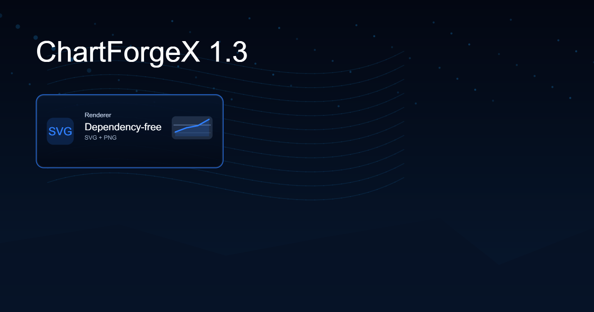
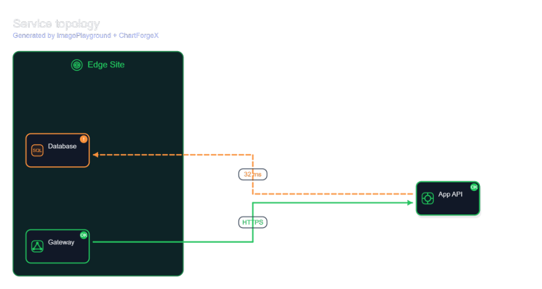
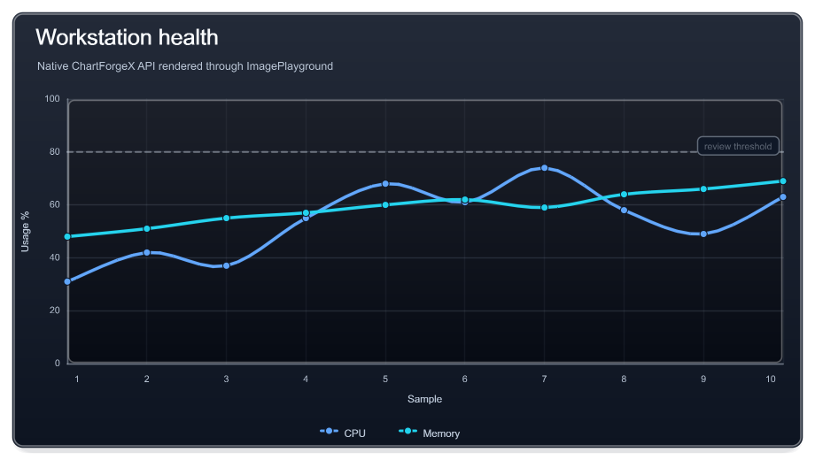
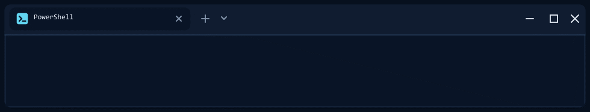
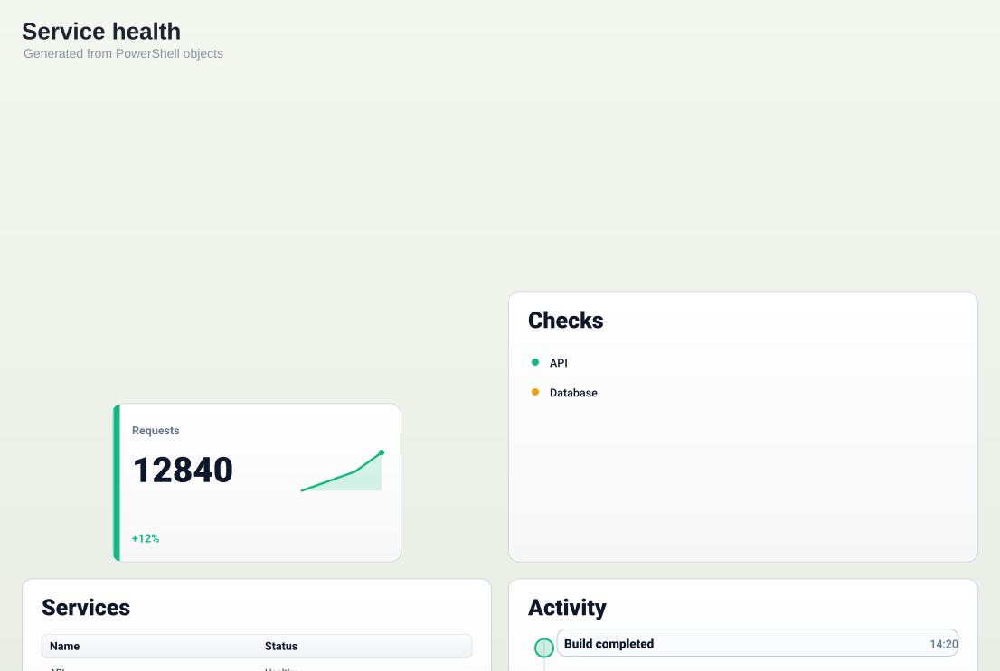

# ImagePlayground - visual automation for PowerShell and .NET

ImagePlayground turns scripts and application data into finished visual assets. Process photographs, inspect or remove metadata, create QR codes and barcodes, render charts and dashboards, map systems and organizations, or publish animated terminal and source-to-result stories without opening an image editor.

## NuGet package

[](https://www.nuget.org/packages/ImagePlayground)
[](https://www.nuget.org/packages/ImagePlayground)

## PowerShell module

[](https://www.powershellgallery.com/packages/ImagePlayground)
[](https://www.powershellgallery.com/packages/ImagePlayground)
[](https://www.powershellgallery.com/packages/ImagePlayground)

## Project information

[](https://github.com/EvotecIT/ImagePlayground/actions/workflows/test_dotnet.yml)
[](https://github.com/EvotecIT/ImagePlayground/actions/workflows/test_powershell.yml)
[](LICENSE)

**Start here:** [install](#installation) · [quick start](#quick-start) · [feature guide](#what-imageplayground-covers) · [PowerShell commands](#complete-powershell-command-map) · [examples](#example-library) · [generated reference](Docs/Readme.md)

## Why ImagePlayground

Automation often ends with something a person must read: a chart in a report, a service map in an incident, a QR code on a device, a sanitized image for publication, or an animated terminal session in documentation. ImagePlayground keeps those results reproducible.

The PowerShell module provides one scripting surface over three reusable .NET owners:

- **ImagePlayground** handles image loading, processing, composition, metadata, and file output.
- **ChartForgeX** handles charts, visual blocks, canvases, topology, hierarchy, and story rendering.
- **CodeGlyphX** handles QR-code and barcode generation and decoding.

PowerShell users install one module. .NET applications reference only the package that owns the capability they need.

## See what it produces

These are real outputs generated with the module in this repository.

<table>
  <tr>
    <td width="50%">
      
      <br /><strong>Canvases and announcement graphics</strong><br />Compose fixed-size social cards, wallpapers, covers, labels, information tiles, and branded backdrops.
    </td>
    <td width="50%">
      
      <br /><strong>Topology and system maps</strong><br />Render grouped services, databases, routes, statuses, ports, details, scenarios, and interactive HTML diagrams.
    </td>
  </tr>
  <tr>
    <td width="50%">
      
      <br /><strong>Charts and report visuals</strong><br />Build business charts, statistical plots, gauges, progress visuals, heatmaps, treemaps, waterfalls, and annotations.
    </td>
    <td width="50%">
      
      <br /><strong>Animated terminal stories</strong><br />Turn authored commands or captured output into SVG, HTML, PNG, GIF, or APNG without executing displayed code.
    </td>
  </tr>
</table>

## What ImagePlayground covers

| Area | What you can produce | Start with |
| --- | --- | --- |
| Image processing | Resized, cropped, rotated, adjusted, blurred, sharpened, converted, compared, merged, watermarked, annotated, or Base64-encoded images | `Resize-Image`, `New-ImageCrop`, `Set-ImageAdjust`, `ConvertTo-Image` |
| Image composition | Thumbnails, avatars, icons, mosaics, grids, animated GIFs, social cards, covers, and wallpapers | `New-ImageThumbnail`, `New-ImageAvatar`, `New-ImageMosaic`, `New-ImageCanvas` |
| Metadata and provenance | EXIF, XMP, IPTC, ICC, C2PA container discovery, direct XMP AI declarations, HEIF information, exports, imports, updates, and controlled removal | `Get-ImageMetadata`, `Get-ImageProvenance`, `Remove-ImageMetadata` |
| QR codes and barcodes | General QR content, contact, Wi-Fi, calendar, email, OTP, payment, cryptocurrency, phone, SMS, location, and common barcode workflows | `New-ImageQRCode`, `New-ImageQRCodeWiFi`, `New-ImageBarCode`, `Get-ImageQRCode` |
| Charts | Static or portable chart output from typed PowerShell definitions or native ChartForgeX charts | `New-ImageChart`, `New-ImageChartLine`, `New-ImageChartBar`, `New-ImageChartOptions` |
| Dashboards and visual blocks | Metric cards, lists, tables, timelines, charts, and mixed grids rendered together | `New-ImageVisualGrid`, `New-ImageMetricCard`, `New-ImageTableBlock` |
| Topology and hierarchy | Service maps, dependency diagrams, organization charts, grouped nodes, ports, diagnostics, scenarios, and route motion | `New-ImageTopology`, `Get-ImageTopologyDiagnostics`, `New-ImageOrganizationChart` |
| Visual stories | Console sessions, source-to-result scenes, declared outcomes, motion cues, watermarks, and portable semantic artifacts | `New-ImageConsoleStory`, `New-ImageStory`, `New-ImageVisualStory`, `ConvertTo-ImageVisualArtifact` |

The [generated PowerShell reference](Docs/Readme.md) contains every cmdlet, parameter set, example, input contract, and output contract.

## PowerShell and .NET entry points

| Task | PowerShell | .NET owner |
| --- | --- | --- |
| Load, manipulate, and save images | `Get-Image`, `Save-Image`, focused `*-Image*` commands | `ImagePlayground.Image`, `ImagePlayground.ImageHelper` |
| Inspect or remove metadata | `Get-ImageMetadata`, `Get-ImageProvenance`, `Remove-ImageMetadata` | `ImagePlayground.ImageHelper` metadata and provenance APIs |
| Create or decode QR codes and barcodes | `New-ImageQRCode*`, `New-ImageBarCode`, `Get-ImageQRCode`, `Get-ImageBarCode` | `CodeGlyphX` |
| Build charts | `New-ImageChart` and `New-ImageChart*` definitions | `ChartForgeX.Core.Chart` |
| Compose dashboards and canvases | `New-ImageVisualGrid`, `New-ImageCanvas`, visual-block commands | `ChartForgeX.VisualBlocks`, `ChartForgeX.VisualCanvas` |
| Map systems and organizations | `New-ImageTopology`, `New-ImageOrganizationChart` | ChartForgeX topology and hierarchy APIs |
| Publish console or visual stories | `New-ImageConsoleStory`, `New-ImageStory`, `New-ImageVisualStory` | ChartForgeX terminal and visual-story APIs |
| Hand visuals to another workflow | `ConvertTo-ImageVisualArtifact`, `Export-ImageVisualArtifact` | ChartForgeX visual artifacts |

## Installation

### PowerShell

ImagePlayground supports Windows PowerShell 5.1 and PowerShell 7+.

```powershell
Install-Module -Name ImagePlayground -Scope CurrentUser
Import-Module ImagePlayground
```

To update an existing installation:

```powershell
Update-Module -Name ImagePlayground
```

### .NET

Install the core package for image loading and processing:

```shell
dotnet add package ImagePlayground
```

Add the owning package when the application also needs charts, topology, QR codes, or barcodes:

```shell
dotnet add package ChartForgeX
dotnet add package CodeGlyphX
```

The ImagePlayground .NET package does not wrap ChartForgeX or CodeGlyphX. That aggregation belongs to the PowerShell module.

## Quick start

### Process and publish an image

```powershell
Resize-Image `
    -FilePath '.\photo.jpg' `
    -OutputPath '.\photo-small.jpg' `
    -Width 1200

Add-ImageWatermark `
    -FilePath '.\photo-small.jpg' `
    -OutputPath '.\photo-published.jpg' `
    -WatermarkPath '.\logo.png' `
    -Placement BottomRight `
    -Opacity 0.7

Get-ImageMetadata -FilePath '.\photo-published.jpg'
```

### Create and verify a QR code

```powershell
New-ImageQRCode `
    -Content 'https://evotec.xyz' `
    -FilePath '.\evotec-qr.png'

$decoded = Get-ImageQRCode -FilePath '.\evotec-qr.png'
$decoded.Text
```

### Render a chart

```powershell
New-ImageChart {
    New-ImageChartBar -Name 'Healthy' -Value 18 -Color MediumSeaGreen
    New-ImageChartBar -Name 'Warning' -Value 3 -Color Orange
    New-ImageChartBar -Name 'Failed' -Value 1 -Color IndianRed
} -FilePath '.\service-health.png' -Width 720 -Height 420 -ShowGrid
```

### Resize an image from .NET

```csharp
using ImagePlayground;

ImageHelper.Resize(
    filePath: "photo.jpg",
    outFilePath: "photo-small.jpg",
    width: 1200,
    height: 1200,
    keepAspectRatio: true);
```

## Image processing and composition

ImagePlayground uses [SixLabors.ImageSharp](https://github.com/SixLabors/ImageSharp) for the main image engine. The primary package does not depend on `System.Drawing`.

### Focused commands for one operation

```powershell
Set-ImageAdjust `
    -FilePath '.\photo.jpg' `
    -OutputPath '.\photo-balanced.jpg' `
    -Brightness 1.05 `
    -Contrast 1.1 `
    -Saturation 1.08

New-ImageCrop `
    -FilePath '.\photo-balanced.jpg' `
    -OutputPath '.\photo-square.jpg' `
    -X 120 -Y 40 -Width 900 -Height 900

ConvertTo-Image `
    -FilePath '.\photo-square.jpg' `
    -OutputPath '.\photo-square.webp' `
    -Quality 85
```

The destination extension selects the output format. JPEG and WebP support `-Quality`; PNG supports `-CompressionLevel`.

### Keep an image open for several edits

```powershell
$image = Get-Image -FilePath '.\photo.jpg'
try {
    $image.Resize(1200, 1200, $true)
    $image.Watermark(
        'Internal',
        [ImagePlayground.WatermarkPlacement]::BottomRight,
        [SixLabors.ImageSharp.Color]::White,
        28)

    Save-Image -Image $image -FilePath '.\photo-watermarked.jpg' -Quality 88
} finally {
    $image.Dispose()
}
```

### Compare, combine, and derive images

| Need | Commands |
| --- | --- |
| Draw text or a wrapped text box | `Add-ImageText`, `Add-ImageTextBox` |
| Apply an image watermark | `Add-ImageWatermark` |
| Compare two images or save a difference mask | `Compare-Image` |
| Merge images | `Merge-Image` |
| Build contact sheets or tiled output | `New-ImageGrid`, `New-ImageMosaic` |
| Create avatars, thumbnails, or icons | `New-ImageAvatar`, `New-ImageThumbnail`, `New-ImageIcon` |
| Build an animation from existing frames | `New-ImageGif` |
| Move image data through text workflows | `ConvertTo-ImageBase64`, `ConvertFrom-ImageBase64` |

<table>
  <tr>
    <td width="50%"><br /><strong>Source</strong></td>
    <td width="50%"><br /><strong>Scripted text and watermark output</strong></td>
  </tr>
</table>

See the focused scripts under [`Examples/Images.*.ps1`](Examples) and the .NET samples in [`Sources/ImagePlayground.Examples`](Sources/ImagePlayground.Examples).

## Metadata, EXIF, HEIF, and provenance

Metadata is part of the publishing workflow, not an afterthought. ImagePlayground can inspect supported profiles, export metadata for review, update selected values, and remove selected families without hiding what happened.

```powershell
$metadata = Get-ImageMetadata -FilePath '.\photo.jpg'
$provenance = Get-ImageProvenance -FilePath '.\photo.jpg'

$metadata
$provenance

Export-ImageMetadata `
    -FilePath '.\photo.jpg' `
    -OutputPath '.\photo-metadata.json'

Remove-ImageMetadata `
    -FilePath '.\photo.jpg' `
    -OutputPath '.\photo-public.jpg' `
    -MetadataType Exif, Xmp `
    -PassThru
```

JPEG and PNG metadata removal preserves compressed pixel data where the format permits it. HEIF and HEIC cleanup is limited to EXIF and XMP.

`Get-ImageProvenance` discovers embedded C2PA containers and direct XMP generative-AI declarations. It does not validate C2PA signatures, trust chains, asset hashes, or the active claim. Use a conforming C2PA validator when cryptographic provenance matters.

HEIF-specific commands can inspect container information and read, set, or remove XMP packets without presenting HEIF pixel decoding as a broader image-editing guarantee.

## QR codes and barcodes

The PowerShell module exposes CodeGlyphX through task-oriented commands. Create a code, save it, and read the final image back in the same workflow.

<table>
  <tr>
    <td width="33%"><br /><strong>Contact</strong></td>
    <td width="33%"><br /><strong>Wi-Fi</strong></td>
    <td width="33%"><br /><strong>Barcode</strong></td>
  </tr>
</table>

### Typed QR payloads

| Payload | Command |
| --- | --- |
| Contact card | `New-ImageQRContact` |
| Wi-Fi network | `New-ImageQRCodeWiFi` |
| Calendar event | `New-ImageQRCodeCalendar` |
| Email draft | `New-ImageQRCodeEmail` |
| One-time password enrollment | `New-ImageQRCodeOtp` |
| Phone number or SMS | `New-ImageQRCodePhoneNumber`, `New-ImageQRCodeSms` |
| Geographic location | `New-ImageQRCodeGeoLocation` |
| Bitcoin or Monero payment | `New-ImageQRCodeBitcoin`, `New-ImageQRCodeMonero` |
| Girocode, BezahlCode, Swiss QR, or Slovenian UPN QR | `New-ImageQRCodeGirocode`, `New-ImageQRCodeBezahlCode`, `New-ImageQRCodeSwiss`, `New-ImageQRCodeSlovenianUpnQr` |
| Shadowsocks or Skype | `New-ImageQRCodeShadowSocks`, `New-ImageQRCodeSkypeCall` |

```powershell
New-ImageQRCodeWiFi `
    -SSID 'Guest WiFi' `
    -Password 'correct horse battery staple' `
    -FilePath '.\guest-wifi.png'

(Get-ImageQRCode -FilePath '.\guest-wifi.png').Text
```

Use `New-ImageBarCode` and `Get-ImageBarCode` for barcode generation and readback. C# applications that only need codes should reference [CodeGlyphX](https://github.com/EvotecIT/CodeGlyphX) directly.

## Charts and report graphics

ImagePlayground provides a PowerShell DSL over ChartForgeX. `New-ImageChart` renders definitions emitted by the typed chart commands, accepts definitions from the pipeline, or accepts a native `ChartForgeX.Core.Chart`.

```powershell
$annotations = New-ImageChartAnnotation `
    -X 4 `
    -Y 74 `
    -Text 'Peak' `
    -Arrow

New-ImageChart {
    New-ImageChartLine `
        -Name CPU `
        -Value 31, 42, 37, 55, 74, 61 `
        -Color CornflowerBlue `
        -Smooth
    New-ImageChartLine `
        -Name Memory `
        -Value 48, 51, 55, 57, 60, 62 `
        -Color MediumSeaGreen `
        -Smooth
} -Annotation $annotations `
  -FilePath '.\workstation-health.svg' `
  -XTitle Sample `
  -YTitle 'Usage %' `
  -ShowGrid
```

### Available chart definitions

- comparison and trend: bar, horizontal bar, line, smooth line, step line, area, stacked area, step area, slope, lollipop
- distribution and relationship: scatter, bubble, histogram, box plot, range band, range bar, heatmap
- part-to-whole: pie, donut, treemap, funnel, pictorial, waterfall
- status and progress: circle, radial, gauge, bullet, progress
- multidimensional and specialist: radar, polar, word cloud
- finishing: annotations, themes, backgrounds, grid, legend, renderer options, watermarks, and DPI metadata

The same chart definition can produce PNG, SVG, or standalone HTML where the selected renderer supports it. See [`Examples/Charts.ChartForgeX.Showcase.ps1`](Examples/Charts.ChartForgeX.Showcase.ps1).

## Canvases, dashboards, and visual blocks

Use a canvas when every element needs an explicit position. Use a visual grid when charts and reusable blocks should flow into dashboard panels.

<table>
  <tr>
    <td width="50%"><br /><strong>Fixed canvas</strong></td>
    <td width="50%"><br /><strong>Adaptive visual grid</strong></td>
  </tr>
</table>

### Fixed canvas

```powershell
New-ImageCanvas `
    -Preset SocialPreview `
    -Title 'ChartForgeX release' `
    -Backdrop TechHorizon `
    -LayerDefinition {
        New-ImageCanvasText `
            -X 72 -Y 72 -Width 1000 `
            -Text 'ChartForgeX 1.3' `
            -FontSize 58 -Color White -Emphasized

        New-ImageCanvasInfoTile `
            -X 72 -Y 190 -Width 380 -Height 150 `
            -Icon SVG -Label Renderer -Value 'Dependency-free' `
            -Detail 'SVG + PNG' `
            -MiniChartKind Area -MiniValues 2, 4, 5, 8
    } `
    -FilePath '.\release-preview.png'
```

### Dashboard grid

```powershell
New-ImageVisualGrid `
    -Title 'Service health' `
    -Subtitle 'Generated from PowerShell objects' `
    -Columns 2 `
    -Theme DashboardLight `
    -ContentDefinition {
        New-ImageMetricCard `
            -Label Requests -Value 12840 -Trend '+12%' `
            -Status Positive -MiniValues 8, 9, 10, 12

        New-ImageListBlock `
            -Title Checks -Item API, Database `
            -Status Positive, Warning

        New-ImageTableBlock `
            -Title Services `
            -Column Name, Status `
            -Row @(
                @{ Name = 'API'; Status = 'Healthy' }
                @{ Name = 'Database'; Status = 'Warning' }
            )

        New-ImageTimelineBlock -Title Activity -ItemDefinition {
            New-ImageTimelineItem `
                -Kind Event -Title 'Build completed' `
                -Timestamp '14:20' -Status Positive
            New-ImageTimelineItem `
                -Kind ChecklistItem -Title 'Smoke tests' -Completed
        }
    } `
    -FilePath '.\service-health.svg'
```

Omit `-FilePath` to retain a reusable grid and pass it to `New-ImageVisualStory` or a native ChartForgeX canvas.

## Topology, scenarios, and organization charts

Topology commands model the system first and render it second. Nodes can belong to groups, expose named ports and detail rows, carry status, and connect through typed edges. Scenarios can highlight an ordered route through the same topology.


```powershell
New-ImageTopology -TopologyDefinition {
    New-ImageTopologyGroup `
        -Id edge -Label 'Edge Site' -Status Healthy

    New-ImageTopologyNode `
        -Id gateway -Label Gateway -Kind Network `
        -Status Healthy -GroupId edge -Symbol GW

    New-ImageTopologyNode `
        -Id api -Label 'App API' -Kind Service `
        -Status Healthy -GroupId edge -Symbol API

    New-ImageTopologyNode `
        -Id database -Label Database -Kind Database `
        -Status Warning -GroupId edge -Symbol SQL

    New-ImageTopologyEdge `
        -SourceNodeId gateway -TargetNodeId api `
        -Label HTTPS -Kind Connectivity -Status Healthy `
        -Direction Forward

    New-ImageTopologyEdge `
        -SourceNodeId api -TargetNodeId database `
        -Label '32 ms' -Kind Dependency -Status Warning `
        -Direction Forward
} -Title 'Service topology' `
  -Layout Layered `
  -Direction LeftToRight `
  -Theme Dark `
  -FitContentToViewport `
  -FilePath '.\service-topology.png'
```

Choose PNG or SVG for static assets, HTML for interactive scenarios, and GIF or APNG when route motion should be sampled into an animation. `Get-ImageTopologyDiagnostics` exposes prepared geometry and routing evidence when a complex diagram needs inspection.

Organization charts use a separate hierarchy-focused surface. See [`Examples/Organization.Engineering.ps1`](Examples/Organization.Engineering.ps1) for a complete branch-oriented hierarchy.

## Console stories

Console stories present a terminal session without coupling documentation to a screen recorder or executing the command shown in the story.


```powershell
$story = New-ImageConsoleStory `
    -WindowStyle WindowsTerminal `
    -Width 980 `
    -Speed Fast `
    -Content {
        New-ImageConsoleStoryTab `
            -Id PowerShell -Title PowerShell `
            -Profile PowerShell -Active

        New-ImageConsoleStoryCommand `
            -Text 'Invoke-EnvironmentAudit.ps1'

        New-ImageConsoleStoryOutput `
            -Text '12 checks passed' -Style Success

        New-ImageConsoleStoryOutput `
            -Text 'Report saved to audit.json' -Style Muted

        New-ImageConsoleStoryPause -Seconds 0.6
    }

$story | Export-ImageConsoleStory -Path '.\audit.svg'
$story | Export-ImageConsoleStory `
    -Path '.\audit.gif' `
    -FramesPerSecond 8 `
    -EndHoldSeconds 1
```

The story can contain typed commands, output, tables, blank lines, pauses, palettes, persistent tabs, and explicit tab switches. A new tab can open in the foreground or be staged in the background. Returning to a tab keeps its transcript.

For a real run, execute the script explicitly and feed captured output into the story:

```powershell
$transcript = & .\Invoke-EnvironmentAudit.ps1 2>&1 |
    Out-String -Stream -Width 110

$story = $transcript | New-ImageConsoleStory `
    -CommandText '.\Invoke-EnvironmentAudit.ps1' `
    -Dialect PowerShell `
    -Theme PowerShell `
    -WindowStyle Minimal

$story | Export-ImageConsoleStory -Path '.\audit.svg'
```

`New-ImageConsoleStory` never executes `-CommandText`.

## Source-to-result and animated visual stories

Generic stories combine resolved source, terminal output, text, images, and SVG into timed scenes. Declared outcomes must be visible in the completed scene, so a story that promises a chart cannot finish with only “Saved chart.png.”

```powershell
$chartPath = '.\weekly-builds.png'

New-ImageChart {
    New-ImageChartLine -Name Builds -Value 12, 18, 15, 24, 31
} -FilePath $chartPath -Width 900 -Height 500

$source = ConvertTo-ImageStorySource `
    -Text (Get-Content '.\Create-WeeklyBuilds.ps1' -Raw) `
    -Language PowerShell

$codePanel = New-ImageStoryPanel -Id code -Source $source
$chartPanel = New-ImageStoryPanel `
    -Id chart -MediaPath $chartPath `
    -AccessibleText 'Weekly builds chart'

$writeScene = New-ImageStoryScene `
    -Id write -Title 'Write five lines' -Panels $codePanel
$resultScene = New-ImageStoryScene `
    -Id result -Title 'See the chart' -Layout Split `
    -Panels $codePanel, $chartPanel
$outcome = New-ImageStoryOutcome `
    -Id chart -Label 'The weekly builds chart is visible.' `
    -PanelId chart

New-ImageStory `
    -Title 'Chart in five lines' `
    -Scenes $writeScene, $resultScene `
    -Outcomes $outcome `
    -FilePath '.\chart-story.gif'
```

PowerShell source highlighting uses the PowerShell parser. C# and Bash can use the optional `ImagePlayground.Syntax.TreeSitter` package. There is no regex-coloring fallback and no Tree-sitter native payload in the normal PowerShell module.

Use `New-ImageVisualStory` when a visual grid should reveal blocks through named motion cues. SVG and HTML preserve script-free animation; PNG, print, and reduced-motion output show the complete final state.

## Portable visual artifacts and Office workflows

`ConvertTo-ImageVisualArtifact` attaches static SVG and versioned semantic JSON bytes to a pipeline object. The SVG is suitable for flat placement; the semantic payload lets a compatible consumer rebuild editable shapes and connectors.

```powershell
$artifact = New-ImageTopology -TopologyDefinition {
    New-ImageTopologyNode -Id api -Label API -Kind Service
    New-ImageTopologyNode -Id database -Label Database -Kind Database
    New-ImageTopologyEdge `
        -Id api-db -SourceNodeId api -TargetNodeId database `
        -Label queries
} -FilePath '.\topology.svg' -PassThru |
    ConvertTo-ImageVisualArtifact `
        -Id service-topology `
        -Title 'Service topology'

$artifact | Export-ImageVisualArtifact -FilePath '.\topology-artifact.svg'
```

When PSWriteOffice is installed, the same artifact can become an editable Visio diagram:

```powershell
$artifact | Export-OfficeVisioVisual -Path '.\topology.vsdx'
```

ImagePlayground owns the PowerShell-facing visual artifact. PSWriteOffice owns Office and Visio document creation.

## Complete PowerShell command map

The current module exports 131 compiled cmdlets and two compatibility aliases. The groups below keep the full surface discoverable without turning the quick start into an alphabetical reference dump.

<details>
<summary><strong>Image processing and files</strong></summary>

- [`Add-ImageText`](Docs/Add-ImageText.md), [`Add-ImageTextBox`](Docs/Add-ImageTextBox.md), [`Add-ImageWatermark`](Docs/Add-ImageWatermark.md)
- [`Compare-Image`](Docs/Compare-Image.md), [`ConvertFrom-ImageBase64`](Docs/ConvertFrom-ImageBase64.md), [`ConvertTo-Image`](Docs/ConvertTo-Image.md), [`ConvertTo-ImageBase64`](Docs/ConvertTo-ImageBase64.md)
- [`Get-Image`](Docs/Get-Image.md), [`Merge-Image`](Docs/Merge-Image.md), [`Resize-Image`](Docs/Resize-Image.md), [`Save-Image`](Docs/Save-Image.md)
- [`New-ImageAvatar`](Docs/New-ImageAvatar.md), [`New-ImageCrop`](Docs/New-ImageCrop.md), [`New-ImageGif`](Docs/New-ImageGif.md), [`New-ImageGrid`](Docs/New-ImageGrid.md), [`New-ImageIcon`](Docs/New-ImageIcon.md), [`New-ImageMosaic`](Docs/New-ImageMosaic.md), [`New-ImageThumbnail`](Docs/New-ImageThumbnail.md)
- [`Set-ImageAdjust`](Docs/Set-ImageAdjust.md), [`Set-ImageBlur`](Docs/Set-ImageBlur.md), [`Set-ImageRotation`](Docs/Set-ImageRotation.md), [`Set-ImageSharpen`](Docs/Set-ImageSharpen.md)

</details>

<details>
<summary><strong>Metadata and provenance</strong></summary>

- [`Clear-ImageThumbnailCache`](Docs/Clear-ImageThumbnailCache.md), [`Export-ImageMetadata`](Docs/Export-ImageMetadata.md), [`Import-ImageMetadata`](Docs/Import-ImageMetadata.md)
- [`Get-ImageExif`](Docs/Get-ImageExif.md), [`Get-ImageMetadata`](Docs/Get-ImageMetadata.md), [`Get-ImageProvenance`](Docs/Get-ImageProvenance.md)
- [`Get-ImageHeifInfo`](Docs/Get-ImageHeifInfo.md), [`Get-ImageHeifXmp`](Docs/Get-ImageHeifXmp.md)
- [`Remove-ImageExif`](Docs/Remove-ImageExif.md), [`Remove-ImageHeifXmp`](Docs/Remove-ImageHeifXmp.md), [`Remove-ImageMetadata`](Docs/Remove-ImageMetadata.md)
- [`Set-ImageExif`](Docs/Set-ImageExif.md), [`Set-ImageHeifXmp`](Docs/Set-ImageHeifXmp.md)

</details>

<details>
<summary><strong>QR codes and barcodes</strong></summary>

- [`Get-ImageBarCode`](Docs/Get-ImageBarCode.md), [`Get-ImageQRCode`](Docs/Get-ImageQRCode.md), [`New-ImageBarCode`](Docs/New-ImageBarCode.md), [`New-ImageQRCode`](Docs/New-ImageQRCode.md)
- [`New-ImageQRContact`](Docs/New-ImageQRContact.md), [`New-ImageQRCodeCalendar`](Docs/New-ImageQRCodeCalendar.md), [`New-ImageQRCodeEmail`](Docs/New-ImageQRCodeEmail.md), [`New-ImageQRCodeGeoLocation`](Docs/New-ImageQRCodeGeoLocation.md), [`New-ImageQRCodeOtp`](Docs/New-ImageQRCodeOtp.md), [`New-ImageQRCodePhoneNumber`](Docs/New-ImageQRCodePhoneNumber.md), [`New-ImageQRCodeSms`](Docs/New-ImageQRCodeSms.md), [`New-ImageQRCodeWiFi`](Docs/New-ImageQRCodeWiFi.md)
- [`New-ImageQRCodeBezahlCode`](Docs/New-ImageQRCodeBezahlCode.md), [`New-ImageQRCodeBitcoin`](Docs/New-ImageQRCodeBitcoin.md), [`New-ImageQRCodeGirocode`](Docs/New-ImageQRCodeGirocode.md), [`New-ImageQRCodeMonero`](Docs/New-ImageQRCodeMonero.md), [`New-ImageQRCodeShadowSocks`](Docs/New-ImageQRCodeShadowSocks.md), [`New-ImageQRCodeSkypeCall`](Docs/New-ImageQRCodeSkypeCall.md), [`New-ImageQRCodeSlovenianUpnQr`](Docs/New-ImageQRCodeSlovenianUpnQr.md), [`New-ImageQRCodeSwiss`](Docs/New-ImageQRCodeSwiss.md)

</details>

<details>
<summary><strong>Charts</strong></summary>

- [`New-ImageChart`](Docs/New-ImageChart.md), [`New-ImageChartOptions`](Docs/New-ImageChartOptions.md), [`New-ImageChartAnnotation`](Docs/New-ImageChartAnnotation.md)
- [`New-ImageChartArea`](Docs/New-ImageChartArea.md), [`New-ImageChartBar`](Docs/New-ImageChartBar.md), [`New-ImageChartBarOptions`](Docs/New-ImageChartBarOptions.md), [`New-ImageChartHorizontalBar`](Docs/New-ImageChartHorizontalBar.md), [`New-ImageChartLine`](Docs/New-ImageChartLine.md), [`New-ImageChartLollipop`](Docs/New-ImageChartLollipop.md), [`New-ImageChartSlope`](Docs/New-ImageChartSlope.md), [`New-ImageChartStackedArea`](Docs/New-ImageChartStackedArea.md), [`New-ImageChartStepArea`](Docs/New-ImageChartStepArea.md), [`New-ImageChartStepLine`](Docs/New-ImageChartStepLine.md)
- [`New-ImageChartBoxPlot`](Docs/New-ImageChartBoxPlot.md), [`New-ImageChartBubble`](Docs/New-ImageChartBubble.md), [`New-ImageChartHeatmap`](Docs/New-ImageChartHeatmap.md), [`New-ImageChartHistogram`](Docs/New-ImageChartHistogram.md), [`New-ImageChartRangeBand`](Docs/New-ImageChartRangeBand.md), [`New-ImageChartRangeBar`](Docs/New-ImageChartRangeBar.md), [`New-ImageChartScatter`](Docs/New-ImageChartScatter.md)
- [`New-ImageChartDonut`](Docs/New-ImageChartDonut.md), [`New-ImageChartFunnel`](Docs/New-ImageChartFunnel.md), [`New-ImageChartPictorial`](Docs/New-ImageChartPictorial.md), [`New-ImageChartPie`](Docs/New-ImageChartPie.md), [`New-ImageChartTreemap`](Docs/New-ImageChartTreemap.md), [`New-ImageChartWaterfall`](Docs/New-ImageChartWaterfall.md)
- [`New-ImageChartBullet`](Docs/New-ImageChartBullet.md), [`New-ImageChartCircle`](Docs/New-ImageChartCircle.md), [`New-ImageChartGauge`](Docs/New-ImageChartGauge.md), [`New-ImageChartProgress`](Docs/New-ImageChartProgress.md), [`New-ImageChartRadial`](Docs/New-ImageChartRadial.md)
- [`New-ImageChartPolar`](Docs/New-ImageChartPolar.md), [`New-ImageChartRadar`](Docs/New-ImageChartRadar.md), [`New-ImageChartWordCloud`](Docs/New-ImageChartWordCloud.md)

</details>

<details>
<summary><strong>Canvases and visual blocks</strong></summary>

- [`New-ImageCanvas`](Docs/New-ImageCanvas.md), [`New-ImageCanvasInfoTile`](Docs/New-ImageCanvasInfoTile.md), [`New-ImageCanvasText`](Docs/New-ImageCanvasText.md)
- [`New-ImageListBlock`](Docs/New-ImageListBlock.md), [`New-ImageMetricCard`](Docs/New-ImageMetricCard.md), [`New-ImageTableBlock`](Docs/New-ImageTableBlock.md), [`New-ImageTimelineBlock`](Docs/New-ImageTimelineBlock.md), [`New-ImageTimelineItem`](Docs/New-ImageTimelineItem.md)
- [`New-ImageVisualGrid`](Docs/New-ImageVisualGrid.md), [`New-ImageVisualGridItem`](Docs/New-ImageVisualGridItem.md)

</details>

<details>
<summary><strong>Topology and organization</strong></summary>

- [`Get-ImageTopologyDiagnostics`](Docs/Get-ImageTopologyDiagnostics.md), [`New-ImageTopology`](Docs/New-ImageTopology.md)
- [`New-ImageTopologyEdge`](Docs/New-ImageTopologyEdge.md), [`New-ImageTopologyGroup`](Docs/New-ImageTopologyGroup.md), [`New-ImageTopologyNode`](Docs/New-ImageTopologyNode.md), [`New-ImageTopologyNodeDetail`](Docs/New-ImageTopologyNodeDetail.md), [`New-ImageTopologyNodePort`](Docs/New-ImageTopologyNodePort.md)
- [`New-ImageTopologyMotion`](Docs/New-ImageTopologyMotion.md), [`New-ImageTopologyScenario`](Docs/New-ImageTopologyScenario.md), [`New-ImageTopologyScenarioStep`](Docs/New-ImageTopologyScenarioStep.md)
- [`New-ImageOrganizationChart`](Docs/New-ImageOrganizationChart.md), [`New-ImageOrganizationMember`](Docs/New-ImageOrganizationMember.md)

</details>

<details>
<summary><strong>Console stories</strong></summary>

- [`New-ImageConsoleStory`](Docs/New-ImageConsoleStory.md), [`Export-ImageConsoleStory`](Docs/Export-ImageConsoleStory.md)
- [`New-ImageConsoleStoryBlankLine`](Docs/New-ImageConsoleStoryBlankLine.md), [`New-ImageConsoleStoryCommand`](Docs/New-ImageConsoleStoryCommand.md), [`New-ImageConsoleStoryOutput`](Docs/New-ImageConsoleStoryOutput.md), [`New-ImageConsoleStoryPause`](Docs/New-ImageConsoleStoryPause.md), [`New-ImageConsoleStoryTable`](Docs/New-ImageConsoleStoryTable.md)
- [`New-ImageConsoleStoryPalette`](Docs/New-ImageConsoleStoryPalette.md), [`New-ImageConsoleStoryTab`](Docs/New-ImageConsoleStoryTab.md), [`Select-ImageConsoleStoryTab`](Docs/Select-ImageConsoleStoryTab.md)

</details>

<details>
<summary><strong>Visual stories and artifacts</strong></summary>

- [`ConvertTo-ImageStorySource`](Docs/ConvertTo-ImageStorySource.md), [`New-ImageStory`](Docs/New-ImageStory.md), [`New-ImageStoryOutcome`](Docs/New-ImageStoryOutcome.md), [`New-ImageStoryPanel`](Docs/New-ImageStoryPanel.md), [`New-ImageStoryScene`](Docs/New-ImageStoryScene.md)
- [`New-ImageVisualMotionCue`](Docs/New-ImageVisualMotionCue.md), [`New-ImageVisualStory`](Docs/New-ImageVisualStory.md), [`New-ImageVisualWatermark`](Docs/New-ImageVisualWatermark.md)
- [`ConvertTo-ImageVisualArtifact`](Docs/ConvertTo-ImageVisualArtifact.md), [`Export-ImageVisualArtifact`](Docs/Export-ImageVisualArtifact.md)

</details>

Compatibility aliases remain available as `New-QRCode` and `New-QRCodeWiFi`. New scripts should use the `New-Image*` names.

```powershell
Get-Command -Module ImagePlayground |
    Sort-Object Noun, Verb
```

## .NET API

The core package targets .NET Standard 2.0, .NET Framework 4.7.2, .NET 8, and .NET 10.

```csharp
using ImagePlayground;
using SixLabors.ImageSharp;

using var image = Image.Load("photo.jpg");
image.Resize(1200, 1200, keepAspectRatio: true);
image.Watermark(
    "Internal",
    WatermarkPlacement.BottomRight,
    Color.White,
    fontSize: 28);
image.Save("photo-watermarked.jpg");
```

### Choose the package that owns the job

| Need | Package |
| --- | --- |
| Image loading, processing, composition, metadata, thumbnails, icons, mosaics, avatars, or GIFs | [`ImagePlayground`](https://www.nuget.org/packages/ImagePlayground) |
| Charts, topology, hierarchy, visual blocks, canvases, or stories | [`ChartForgeX`](https://www.nuget.org/packages/ChartForgeX) |
| QR codes, barcodes, GS1 data, renderers, or image decoding | [`CodeGlyphX`](https://www.nuget.org/packages/CodeGlyphX) |
| PowerShell access to all three owners | [`ImagePlayground`](https://www.powershellgallery.com/packages/ImagePlayground) module |

## Output and interoperability

| Surface | Typical output |
| --- | --- |
| Image processing | PNG, JPEG, WebP, GIF, BMP, and other ImageSharp-supported formats selected by extension |
| Charts and static report visuals | PNG and SVG, with standalone HTML where supported |
| Topology | PNG, SVG, interactive HTML, GIF, and APNG |
| Console stories | SVG, HTML, PNG, GIF, and APNG |
| Generic and animated visual stories | SVG, HTML, PNG, GIF, and APNG where supported by the selected renderer |
| Visual artifacts | Static SVG plus versioned semantic JSON bytes |

PowerShell commands have one execution path. Commands that can use asynchronous file APIs do so internally and honor pipeline cancellation; there is no `-Async` switch because a PowerShell invocation still completes before control returns to the caller.

## Example library

| Workflow | Example |
| --- | --- |
| Image adjustments, crop, rotation, text, watermark, metadata, thumbnails, mosaic, and conversion | [`Examples/Images.*.ps1`](Examples) |
| QR codes and barcodes | [`Examples/QrCode.ps1`](Examples/QrCode.ps1), [`Examples/QrCodeWithLogo.ps1`](Examples/QrCodeWithLogo.ps1), [`Examples/Barcode.Create.ps1`](Examples/Barcode.Create.ps1) |
| Chart gallery | [`Examples/Charts.ChartForgeX.Showcase.ps1`](Examples/Charts.ChartForgeX.Showcase.ps1) |
| Social preview canvas | [`Examples/Canvas.SocialPreview.ps1`](Examples/Canvas.SocialPreview.ps1) |
| Service-health dashboard | [`Examples/VisualGrid.ServiceHealth.ps1`](Examples/VisualGrid.ServiceHealth.ps1) |
| Service topology and route animation | [`Examples/Topology.ServiceMap.ps1`](Examples/Topology.ServiceMap.ps1), [`Examples/Topology.RouteAnimation.ps1`](Examples/Topology.RouteAnimation.ps1) |
| Organization hierarchy | [`Examples/Organization.Engineering.ps1`](Examples/Organization.Engineering.ps1) |
| Console stories | [`Examples/ConsoleStory.TabNavigation.ps1`](Examples/ConsoleStory.TabNavigation.ps1), [`Examples/ConsoleStory.CapturedScript.ps1`](Examples/ConsoleStory.CapturedScript.ps1) |
| Generic source-to-result story | [`Examples/Story.ChartInFiveLines.ps1`](Examples/Story.ChartInFiveLines.ps1) |

The curated [Website examples](Website/content/examples/_index.md) provide shorter source-to-result walkthroughs. The generated [command reference](Docs/Readme.md) contains at least one example for every exported cmdlet.

## Documentation

- [Generated PowerShell command reference](Docs/Readme.md)
- [Website documentation](Website/content/project-docs/docs/_index.md)
- [Workflow selection guide](Website/content/project-docs/docs/workflows.md)
- [Charts, topology, and visual reporting](Website/content/project-docs/docs/visual-reporting.md)
- [PowerShell example scripts](Examples)
- [.NET example project](Sources/ImagePlayground.Examples)
- [HEIC support investigation](Docs/HEIC-Support-Investigation.md)

Generated command Markdown and external help come from the C# XML documentation through PSPublishModule/PowerForge. Update the source comments and regenerate instead of editing command pages by hand.

## Compatibility and current boundaries

- PowerShell: Windows PowerShell 5.1 and PowerShell 7+
- Core library: .NET Standard 2.0, .NET Framework 4.7.2, .NET 8, and .NET 10
- Main image engine: SixLabors.ImageSharp
- Chart, topology, canvas, and story engine: ChartForgeX
- QR-code and barcode engine: CodeGlyphX
- Optional C# and Bash source highlighting: `ImagePlayground.Syntax.TreeSitter`

HEIF and HEIC support is deliberately narrower than normal ImageSharp-backed image processing. The HEIF commands inspect container data and manage EXIF/XMP paths described by their command documentation; they do not imply unrestricted HEIF pixel editing.

## Breaking changes in 3.0

ImagePlayground 3.0 removed the PowerShell `-Async` parameter and the Windows-only `ImagePlayground.Gdi` project. Invoke asynchronous-capable commands normally.

The PowerShell module keeps chart-definition, topology, QR-code, and barcode commands as thin adapters. C# callers should use ChartForgeX or CodeGlyphX directly for those capabilities.

## Troubleshooting

### The installed module has fewer commands than this repository

```powershell
Get-Module -ListAvailable ImagePlayground |
    Sort-Object Version -Descending |
    Select-Object -First 1 Name, Version, Path

Get-Command -Module ImagePlayground |
    Sort-Object Name
```

Repository source, an open branch, the PowerShell Gallery package, and the version installed on a machine are separate release states.

### A QR code or barcode was created but does not scan

Decode the final saved artifact with `Get-ImageQRCode` or `Get-ImageBarCode`, then test the real device or application that must consume it. Styling and image composition can affect scanability even when the payload itself is valid.

### A topology or story looks different in PNG and HTML

PNG represents the completed static state. HTML and SVG may retain interaction or motion. Reduced-motion and print output intentionally expose the final readable state rather than hiding content behind animation.

### A complex topology needs layout evidence

Use `-IncludeLayoutDiagnostics` with `New-ImageTopology` or inspect the prepared result with `Get-ImageTopologyDiagnostics` before changing node coordinates or routing options blindly.

## Build and test

```powershell
dotnet build .\Sources\ImagePlayground.sln --configuration Release
dotnet test .\Sources\ImagePlayground.Tests\ImagePlayground.Tests.csproj --configuration Release
pwsh -File .\ImagePlayground.Tests.ps1
```

For a local source-module session:

```powershell
dotnet build `
    .\Sources\ImagePlayground.PowerShell\ImagePlayground.PowerShell.csproj `
    --configuration Debug `
    --framework net8.0

$env:IMAGEPLAYGROUND_DEVELOPMENT = '1'
Import-Module .\ImagePlayground.psd1 -Force
```

## Author and community

[](https://evotec.xyz/hub)
[](https://www.linkedin.com/in/pklys)
[](https://evo.yt/discord)

## License

ImagePlayground is available under the [MIT License](LICENSE).
